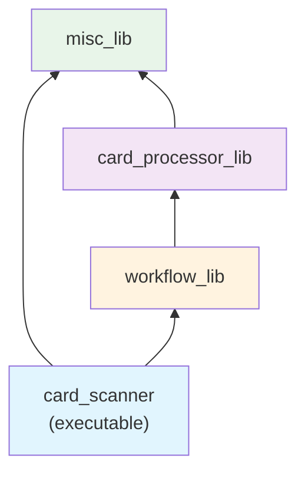

# Card Scanner

A C++17 application for detecting, processing, and extracting text from Magic: The Gathering (MTG) cards using OpenCV and Tesseract OCR. Designed for automated card scanning with deployment to Raspberry Pi.

---

## Table of Contents

- [Overview](#overview)
- [Architecture](#architecture)
- [Project Structure](#project-structure)
- [Dependencies](#dependencies)
- [Building](#building)
- [Usage](#usage)
- [Testing](#testing)
- [Development](#development)
- [Raspberry Pi Deployment](#raspberry-pi-deployment)
- [CI/CD Pipeline](#cicd-pipeline)
- [Contract / Communication Protocol](#contract--communication-protocol)

---

## Overview

The Card Scanner application processes images of MTG cards through a multi-stage pipeline:
1. **Card Detection** – Identifies card boundaries using contour analysis
2. **Perspective Correction** – Warps cards to a normalized 480×680 pixel format
3. **Tilt Correction** – Corrects any residual rotation
4. **Region Extraction** – Locates name, set, collector number, and art regions
5. **OCR Processing** – Extracts text using Tesseract (in development)

### Key Features

- **Builder Pattern Workflow** – Extensible `DetectionWorkflow` class for different card types
- **Region Extraction** – Automatic detection of card name, set, collector number, and art regions
- **OCR Integration** – Tesseract-based text extraction with preprocessing
- **Architecture-Specific Lockfiles** – Reproducible builds for x86_64 and ARM (Raspberry Pi)
- **Comprehensive Testing** – Integration tests with sample card images
- **CI/CD** – GitHub Actions for linting, building, testing, and lockfile drift detection

---

## Architecture

### Component Hierarchy

```mermaid
graph TB
    subgraph Main["Main Application (main.cpp)"]
        CLI["CLI Parsing"]
        Save["Save Results"]
    end

    subgraph Workflow["workflow_lib"]
        DW["DetectionWorkflow<br/><i>detection_builder.hpp/cpp</i>"]
        DW_Methods["• process(imagePath)<br/>• processModernNormal()<br/>• readTextFromRegions()"]
    end

    subgraph CardProc["card_processor_lib"]
        CD["card_detector<br/><i>processCards(), warpCard()</i>"]
        TC["tilt_corrector<br/><i>correctCardTilt()</i>"]
        RE["region_extraction<br/><i>extractNameRegion(), etc.</i>"]
        OCR["card_text_ocr<br/><i>extractText(), preprocessForOcr()</i>"]
    end

    subgraph Misc["misc_lib"]
        PH["pic_helper<br/><i>saveImage(), displayResults()</i>"]
        PATH["path_helper<br/><i>getSamplesPath()</i>"]
    end

    subgraph External["External Libraries"]
        OpenCV["OpenCV"]
        Tesseract["Tesseract"]
        spdlog["spdlog"]
        libassert["libassert"]
        gsl["ms-gsl"]
    end

    CLI --> DW
    DW --> Save
    DW --> DW_Methods
    DW --> CD
    DW --> TC
    DW --> RE
    DW --> OCR
    CardProc --> Misc
    CardProc --> External
    Misc --> External
```



### Processing Pipeline (Modern Normal Cards)

```mermaid
flowchart LR
    A[📷 Image File] --> B[Load Image]
    B --> C[Detect Card<br/>Boundaries]
    C --> D[Warp to<br/>480×680]
    D --> E[Correct Tilt]
    E --> F[Extract Regions]
    
    F --> G[🟢 Name Region]
    F --> H[🔴 Collector Number]
    F --> I[🔵 Set Name]
    F --> J[🟡 Art Region]
    
    G --> K[OCR Text<br/>Extraction]
    H --> K
    I --> K
    
    K --> L[📤 Output Image<br/>with Boxes]
```



### Library Dependencies



---

## Project Structure

```
cards_scanner/
├── CMakeLists.txt              # Root CMake configuration
├── conanfile.txt               # Conan dependencies specification
├── conan-x86_64.lock           # Lockfile for x86_64 builds
├── conan-armv8.lock            # Lockfile for ARM64 builds (Raspberry Pi)
├── CMakeUserPresets.json       # CMake user presets
│
├── build.sh                    # Incremental build script
├── rebuild.sh                  # Clean rebuild script
├── run_test.sh                 # Test execution script
├── update_lock.sh              # Update architecture lockfiles
├── clang_tidy.sh               # Static analysis script
├── run_ansible.sh              # Raspberry Pi deployment script
│
├── .clang-tidy                 # Clang-tidy configuration
├── .gitignore                  # Git ignore rules
│
├── src/                        # Source code
│   ├── CMakeLists.txt          # Source build configuration
│   ├── main.cpp                # Application entry point
│   │
│   ├── workflow/               # Workflow orchestration (workflow_lib)
│   │   ├── CMakeLists.txt
│   │   ├── include/
│   │   │   └── detection_builder.hpp
│   │   └── impl/
│   │       └── detection_builder.cpp
│   │
│   ├── detection/              # Card processing (card_processor_lib)
│   │   ├── CMakeLists.txt
│   │   ├── include/
│   │   │   ├── card_detector.hpp
│   │   │   ├── card_text_ocr.hpp
│   │   │   ├── region_extraction.hpp
│   │   │   └── tilt_corrector.hpp
│   │   └── impl/
│   │       ├── card_detector.cpp
│   │       ├── card_text_ocr.cpp
│   │       ├── region_extraction.cpp
│   │       └── tilt_corrector.cpp
│   │
│   └── misc/                   # Utilities (misc_lib)
│       ├── CMakeLists.txt
│       ├── include/
│       │   ├── pic_helper.hpp
│       │   └── path_helper.hpp
│       └── impl/
│           ├── pic_helper.cpp
│           └── path_helper.cpp
│
├── tests/                      # Test suite
│   ├── integration/
│   │   ├── CMakeLists.txt
│   │   ├── test_card_detection.cpp
│   │   └── test_detection_builder.cpp
│   └── sample_cards/           # Test input images (JPG)
│
├── ansible/                    # Raspberry Pi provisioning
│   ├── set_up_raspi.yml        # Main playbook
│   ├── inventory.ini           # Target hosts
│   ├── example_inventory.ini   # Inventory template
│   └── plays/
│       ├── apt_update_upgrade.yml
│       └── install_opencv_dependencies.yml
│
└── .github/workflows/          # CI/CD pipelines
    ├── ci.yml                  # Build, test, lint, lock-drift
    └── lint_ansible.yml        # Ansible playbook linting
```

### Library Architecture

| Library | Sources | Description |
|---------|---------|-------------|
| **workflow_lib** | `src/workflow/` | Orchestrates the detection pipeline using builder pattern. Depends on card_processor_lib. |
| **card_processor_lib** | `src/detection/` | Core card processing: detection, warping, tilt correction, region extraction, OCR. Depends on misc_lib. |
| **misc_lib** | `src/misc/` | Utilities for image I/O, path management, and debugging. |

---

## Dependencies

| Dependency | Version | Purpose |
|------------|---------|---------|
| **OpenCV** | 4.10.0 | Image processing and computer vision |
| **Tesseract** | 5.5.0 | OCR text extraction |
| **spdlog** | 1.15.1 | Fast C++ logging |
| **libassert** | 2.1.4 | Enhanced assertions |
| **ms-gsl** | 4.1.0 | Guidelines Support Library |
| **Google Test** | 1.13.0 | Testing framework |
| **zstd** | 1.5.5 | Compression (Tesseract dependency) |

### Build Tools

| Tool | Version | Purpose |
|------|---------|---------|
| **CMake** | ≥ 3.18 | Build system |
| **Conan** | ≥ 2.0 | Dependency management |
| **C++ Compiler** | C++17 | GCC/Clang with C++17 support |
| **clang-tidy** | Latest | Static analysis |

---

## Development Setup

### Option 1: Dev Container (Recommended)

The easiest way to develop is using VS Code Dev Containers. This provides a fully configured development environment in Docker without installing dependencies on your system.

**Prerequisites:**
- [Docker](https://docs.docker.com/get-docker/) installed and running
- [VS Code](https://code.visualstudio.com/) with the [Dev Containers extension](https://marketplace.visualstudio.com/items?itemName=ms-vscode-remote.remote-containers)

**Getting Started:**

1. Open the project in VS Code
2. Press `F1` and select **"Dev Containers: Reopen in Container"**
3. Wait for the container to build (first time takes a few minutes)
4. Once ready, build the project:
   ```bash
   ./rebuild.sh
   ```

**What's Included:**
- Ubuntu 22.04 base
- CMake, Ninja, GCC
- Conan 2.x (pre-configured)
- clang-tidy, clang-format
- OpenCV and Tesseract system libraries
- VS Code extensions for C++ development
- Persistent Conan cache (survives container rebuilds)

**Dev Container Features:**
- IntelliSense and code completion
- Integrated debugging
- CMake Tools integration
- Automatic formatting on save

### Option 2: Native Installation

If you prefer to install dependencies directly on your system:

```bash
# Install Conan
pip install conan>=2.0.0

# Configure Conan profile
conan profile detect

# Install CMake and compiler
sudo apt install cmake build-essential

# Install clang-tidy (optional, for linting)
sudo apt install clang-tidy
```

---

## Building

### Quick Build (Incremental)

```bash
./build.sh          # Standard build
./build.sh -v       # Verbose output
```

### Clean Rebuild

```bash
./rebuild.sh        # Removes build/, reconfigures, and builds
./rebuild.sh -v     # Verbose output
```

### Manual Build

```bash
mkdir build && cd build
cmake ..
cmake --build .
```

The executable will be at `build/card_scanner`.

### Dependency Management

This project uses **Conan 2** with architecture-specific lockfiles for reproducible builds:

- `conan-x86_64.lock` – For x86_64 systems (Linux servers, CI)
- `conan-armv8.lock` – For ARM64 systems (Apple Silicon, Raspberry Pi)

**Update lockfiles** (after changing dependencies):
```bash
./update_lock.sh            # Generates both lockfiles
git add conan-*.lock
git commit -m "chore(deps): update lockfiles"
```

---

## Usage

### Command Line Interface

```bash
./build/card_scanner [options]
```

### Options

| Option | Description |
|--------|-------------|
| `-f, --file <path>` | Process a card from an image file |
| `-h, --help` | Show help message |

### Examples

```bash
# Process a single card image
./build/card_scanner -f /path/to/card_image.jpg

# Show help
./build/card_scanner --help
```

### Output

The application will:
1. Load and process the card image
2. Detect card boundaries and apply perspective correction
3. Correct any tilt
4. Extract name, set, collector number, and art regions
5. Draw colored bounding boxes on the result:
   - **Green** – Name region
   - **Red** – Collector number region
   - **Blue** – Set name region
   - **Yellow** – Art region
6. Save the processed image to `tests/test_samples/`

---

## Testing

### Run All Tests

```bash
./run_test.sh
```

Or manually:
```bash
cd build && ctest -V
```

### Test Files

| Test File | Description |
|-----------|-------------|
| `test_card_detection.cpp` | Card detection and tilt correction tests |
| `test_detection_builder.cpp` | Full workflow pipeline tests |

### Adding Test Images

Place new test images in `tests/sample_cards/` (JPG format).

---

## Development

### Static Analysis

Run clang-tidy on all source files:
```bash
./clang_tidy.sh
```

### Code Style

The project uses `.clang-tidy` for enforcing code style. See the configuration file for enabled checks.

### Adding New Card Types

1. Add a new enum value to `CardType` in [detection_builder.hpp](src/workflow/include/detection_builder.hpp)
2. Implement a `processXxx()` method in `DetectionWorkflow`
3. Add the case to the `process()` switch statement

---

## Raspberry Pi Deployment

### Prerequisites

1. SD card with Raspbian OS (set up and expanded)
2. SSH enabled on the Raspberry Pi
3. SSH key for passwordless access:
   ```bash
   ssh-copy-id pi@your_raspi.local
   ```
4. Locale set to UTF-8:
   ```bash
   export LC_ALL=en_US.UTF-8
   ```

### Configure Inventory

```bash
cp ansible/example_inventory.ini ansible/inventory.ini
# Edit inventory.ini with your Raspberry Pi hostname
```

Example `inventory.ini`:
```ini
[raspi]
your_raspi.local ansible_user=pi
```

### Deploy

```bash
# Full deployment
./run_ansible.sh

# Lint playbooks only
./run_ansible.sh lint
```

### Ansible Playbooks

The deployment performs:
1. System package update/upgrade
2. OpenCV dependency installation

### TODO

- Install Conan on Raspberry Pi for full build support

---

## CI/CD Pipeline

### GitHub Actions Workflows

| Workflow | File | Triggers | Jobs |
|----------|------|----------|------|
| **CI** | `ci.yml` | Push/PR to main | lint, build-and-test, lock-drift |
| **Ansible Lint** | `lint_ansible.yml` | Push/PR to main | lint |

### CI Jobs

1. **lint** – Runs clang-tidy on all source files
2. **build-and-test** – Builds the project and runs tests
3. **lock-drift** – Validates lockfile is up-to-date (fails if dependencies changed without updating lockfile)

### Lockfile Validation

The CI validates that lockfiles match current dependencies:
```bash
conan lock create . --lockfile="conan-x86_64.lock" --lockfile-out=drift.lock --build=never
diff conan-x86_64.lock drift.lock
```

If drift is detected, run `./update_lock.sh` locally and commit the updated lockfiles.

---

## Contract / Communication Protocol

> **Note**: This describes the intended production behavior for Raspberry Pi deployment.

### Startup Configuration

On startup, the device receives configuration from a PC:
- **Bin numbers** to use
- **Bin fullness** status
- **Card kind** filters

### Post-OCR Communication
- Not sure yet
---

## License

*Add license information here*

---

## Contributing

*Add contribution guidelines here*


# Notes for HW build
- We want most likely Off-axis bright field lighting with an 18-20 degree tilt in the light to rmeove hot spots
